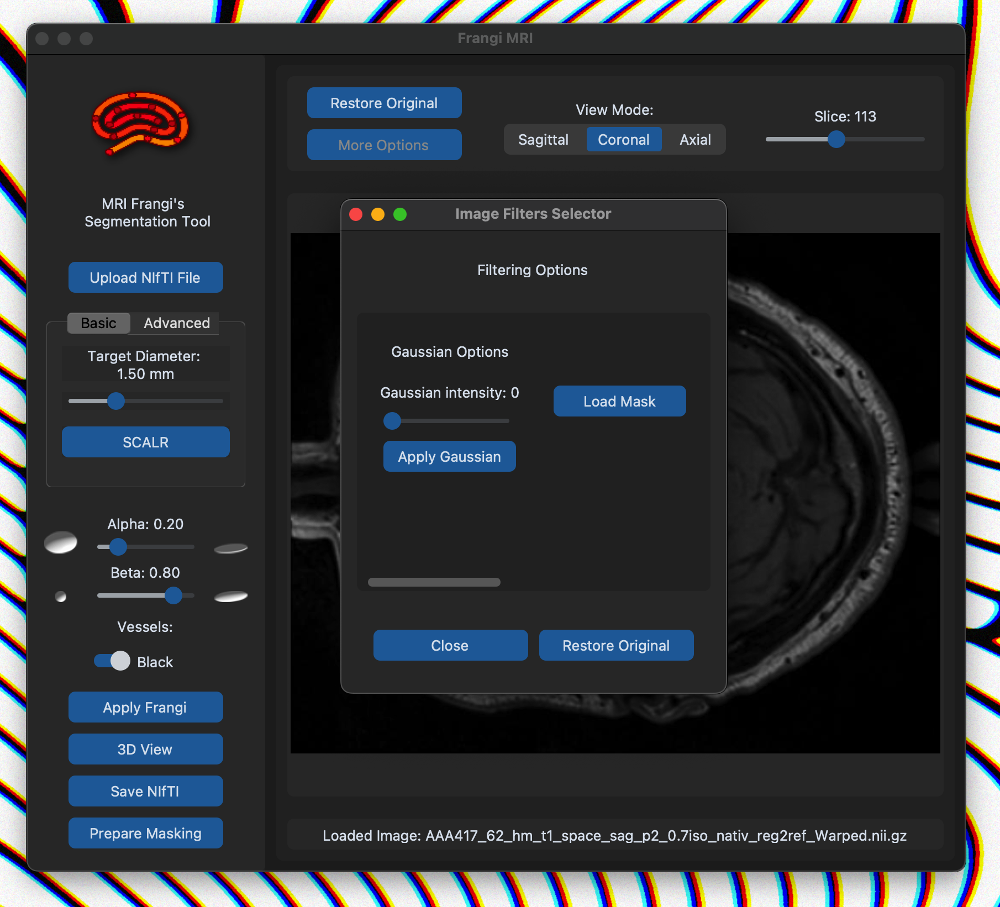

# Fangi's Multi-Scale Vesselness Filter GUI
Preivascular Spaces (PVS) pathfinder(beta)


# MRI Vesselness Tool

This tool is designed for MRI data. It provides a user interface for uploading an MRI image, adjusting the Frangi's equation variables as slider parameters, and process the path higlight.

## Installation

Ensure you have Python 3.x installed on your system. (for MacOS users make sure python-tk is installe in the homebrew)

```bash
brew install python-tk
```

First create a virtual enviroment where to install all the dependencies for this Python application using:

```bash
virtualenv venv
```

Then activate the Virtual enviroment you just created with:

```bash
source venv/bin/activate
```

Then clone this repository, navigate to the directory where requirements.txt lives, and install the dependencies using:

```bash
pip install -r requirements.txt
```

## Usage

Run the script using:

```bash
python3 frangiGUI.py
```

Upon running the script, a GUI window will open. Follow the instructions on the GUI to perform segmentation.

## Features

- **Image Upload**: Easily upload an image for segmentation, preferably an MRI scan.
- **Interactive Visualization**: Visualize the MRI scan in Axial, Coronal, or Sagittal mode, allowing for easy exploration and analysis.
- **3D Visualization**: Utilize Napari's volumetric engine for immersive 3D visualization of the image.
- **Customizable Parameters**: Set parameters such as alpha (for plate-like or ellipsoid-like shape), beta (for blobness or spherical shape), c (for background noise reduction), and the range of scales according to your segmentation needs.
- **Segmentation Processing**: Process the segmentation with ease, including bonus filters like Gaussian blur and threshold slider for fine-tuning the results.

## Walkthrough Images

Upon opening the app, the initial window should resemble the following:


Next, select an MRI image in .nii format as shown:


Once the image loads, the interface will display the first slice of your file along with tools and options for customization:


The interface offers various options, including different filters and visualization tools, along with a slider to navigate through each slice of your 3D image:



To apply segmentation, set the parameters alpha, beta and scale range manually on advanced mode:


Or Click the SCALR button for automatic scale selection:


Once the selection is made, click the "Apply Frangi" button to initiate the Frangi's filtering process:


You can also visualize the segmented image in 3D:


## Dependencies

- `customtkinter`: A custom module for enhanced GUI elements.
- `tkinter`: Standard Python interface to the Tk GUI toolkit (usually comes pre-installed with Python).
- `PIL`: Python Imaging Library to work with images (usually comes pre-installed with Python).
- `Python`: Python version 3.6 or higher.
- `numpy`: A powerful library for numerical computing.
- `nibabel`: A library for reading and writing neuroimaging data in various formats.
- `matplotlib`: A plotting library for creating static, animated, and interactive visualizations in Python.


## Contributing

Contributions are welcome! Please open an issue to discuss potential changes/additions.

## License

This project is licensed under the [Universidad del Valle] 2024