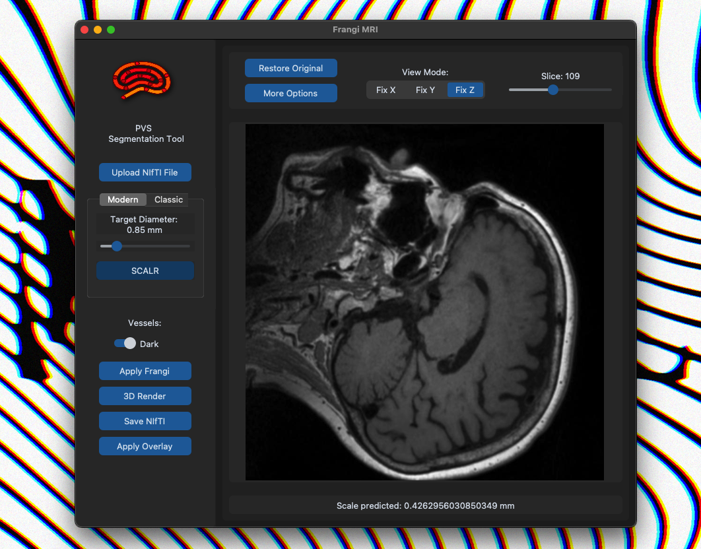

# Fangi's Multi-Scale Vesselness Filter GUI
**Prevascular Spaces (PVS) Pathfinding Tool (Beta)**

## Overview

This tool provides a user-friendly interface for processing MRI data using Frangi’s Multi-Scale Vesselness Filter. It allows for the segmentation of Prevascular Spaces (PVS) in MRI scans, which is essential for medical imaging analysis. The application supports parameter adjustments for Frangi's equation through interactive sliders and provides advanced options for fine-tuning the results.

For detailed information, please refer to the [full research paper](./paper/SCALR_PAPER.pdf) (PDF).

## Installation

Ensure that you have **Python 3.x** installed on your system. You will also need a few additional tools, depending on your operating system.

### macOS

1. Install the necessary dependencies using Homebrew (for Tkinter support):
   ```bash
   brew install python-tk
   ```

2. Create a virtual environment to install the dependencies:
   ```bash
   python3 -m venv venv
   ```

3. Activate the virtual environment:
   ```bash
   source venv/bin/activate
   ```

4. Clone this repository and navigate to the directory where the `requirements.txt` file is located:
   ```bash
   git clone https://github.com/yourusername/Frangi-GUI.git
   cd Frangi-GUI/GUI
   ```

5. Install the required dependencies:
   ```bash
   pip install -r requirements.txt
   ```

### Windows and Linux

For **Windows** and **Linux** systems, follow these steps:

1. Ensure Python 3.x is installed. If Tkinter is missing, you can install it using the following commands:

   **Windows:**
   Tkinter should already be bundled with Python. If not, you can download and install it separately.

   **Linux (Ubuntu/Debian):**
   ```bash
   sudo apt-get install python3-tk
   ```

2. Create and activate a virtual environment:
   ```bash
   python3 -m venv venv
   source venv/bin/activate  # Linux
   venv\Scripts\activate     # Windows
   ```

3. Clone the repository and install the required dependencies:
   ```bash
   git clone https://github.com/yourusername/Frangi-GUI.git
   cd Frangi-GUI/GUI
   pip install -r requirements.txt
   ```

## Usage

To start the GUI, run the following command:

```bash
python3 frangiGUI.py
```

Upon running the script, a graphical user interface (GUI) will open. From there, you can upload an MRI scan and adjust the parameters for the Frangi filter to segment the Prevascular Spaces (PVS).

### Features

- **Image Upload**: Upload an MRI scan in NIfTI format (.nii).
- **Interactive Visualization**: Explore the MRI scan in Axial, Coronal, or Sagittal views.
- **3D Visualization**: View the MRI scan in 3D using Napari’s volumetric engine for immersive exploration.
- **Customizable Parameters**: Fine-tune Frangi's filter parameters such as alpha (plate-like or ellipsoid-like), beta (blobness), and c (background noise reduction).
- **Segmentation Processing**: Apply segmentation with options like Gaussian blur and customizable threshold sliders for refining results.

### Walkthrough

1. **Start Screen**: Upon opening the application, the first window will appear with an option to upload an image:
   

2. **Upload Image**: Select an MRI image in NIfTI format (.nii):
   

3. **Image Loaded**: Once the image is loaded, you’ll see the first slice along with available customization tools:
   

4. **Advanced Options**: Use the slider to adjust the parameters, or enable advanced mode for manual fine-tuning:
   

5. **Automatic Scale Selection**: Click the **SCALR** button for automatic scale selection:
   

6. **Apply Frangi Filter**: Click the **Apply Frangi** button to begin the segmentation process:
   
   

7. **3D Visualization**: Optionally, visualize the segmented image in 3D:
   

## Dependencies

The following dependencies are required to run this tool:

- `customtkinter`: A custom library to enhance GUI elements.
- `tkinter`: Standard Python interface to the Tk GUI toolkit (usually pre-installed).
- `PIL`: Python Imaging Library for image handling.
- `numpy`: For numerical operations.
- `nibabel`: For reading and writing neuroimaging data.
- `matplotlib`: For creating visualizations.
- `napari`: For 3D visualization of MRI data.

### Installing Dependencies

Once the virtual environment is set up, you can install the required dependencies using:

```bash
pip install -r requirements.txt
```

## Contributing

We welcome contributions! If you find a bug or have suggestions for new features, please open an issue or submit a pull request.

## License

This project is licensed under the [MIT License](LICENSE).

---
For more information on the research behind this tool, refer to the [research paper](./paper/SCALR_PAPER.pdf) (PDF).
