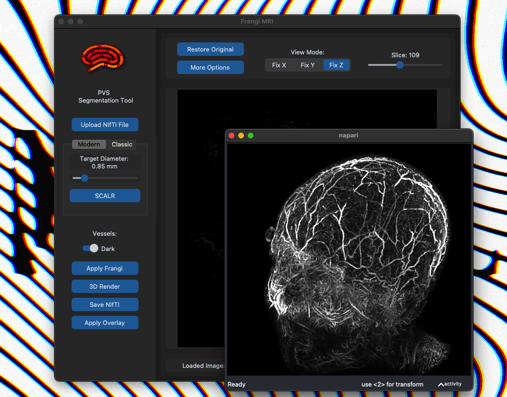

# Fangi's Multi-Scale Vesselness Filter GUI
**Prevascular Spaces (PVS) Segmentation Tool**

## Overview

This repository contains the full implementation of **SCALR**, a machine learning–based tool developed as part of my **Laureate Thesis** in Systems and Computer Science Engineering. The thesis was awarded distinction for its contribution to optimizing the Frangi filter for improved perivascular space (PVS) quantification in brain MRI.

SCALR provides a user-friendly interface for processing MRI data using Frangi's Multi-Scale Vesselness Filter. It enables accurate segmentation of PVS by predicting the optimal filtering scale based on the image's noise level and resolution. The application includes interactive sliders for parameter tuning and advanced configuration options to refine the filtering process.

For the complete methodology and research context, refer to the [research paper](./paper/SCALR_PAPER.pdf) (PDF).

## Installation

Ensure that you have **Python 3.x** installed on your system. You will also need a few additional tools, depending on your operating system.

### macOS

1. Install the necessary dependencies using Homebrew (for Tkinter support):
   ```bash
   brew install python-tk
   ```

2. Create a virtual environment and install dependencies:

   ```bash
   python3 -m venv venv
   source venv/bin/activate  # Activate the virtual environment
   ```

3. Clone this repository:

   ```bash
   git clone https://github.com/riddimental/Frangi-GUI.git
   cd Frangi-GUI/GUI
   ```

4. Install the required dependencies:

   ```bash
   pip install -r requirements.txt
   ```

### Windows

1. Ensure **Python 3.x** is installed on your system. Tkinter should be bundled with Python. If it is missing, you can install it via the following:

   * Open the **Command Prompt** and run:

     ```bash
     python -m ensurepip --upgrade
     ```

2. Create a virtual environment and activate it:

   ```bash
   python -m venv venv
   venv\Scripts\activate  # Activate the virtual environment
   ```

3. Clone the repository and install the dependencies:

   ```bash
   git clone https://github.com/riddimental/Frangi-GUI.git
   cd Frangi-GUI/GUI
   pip install -r requirements.txt
   ```

### Linux (Ubuntu/Debian)

1. Install the necessary dependencies:

   ```bash
   sudo apt-get install python3-tk
   ```

2. Create a virtual environment and activate it:

   ```bash
   python3 -m venv venv
   source venv/bin/activate  # Activate the virtual environment
   ```

3. Clone the repository and install the dependencies:

   ```bash
   git clone https://github.com/riddimental/Frangi-GUI.git
   cd Frangi-GUI/GUI
   pip install -r requirements.txt
   ```

## Usage

To start the GUI, run the following command:

```bash
python3 frangiGUI.py
```

Upon running the script, the graphical user interface (GUI) will open. From there, you can upload an MRI scan and adjust the parameters for the Frangi filter to segment the Prevascular Spaces (PVS).

### Features

* **Image Upload**: Upload an MRI scan in NIfTI format (.nii or .nii.gz).
* **Interactive Visualization**: Explore the MRI scan in Axial, Coronal, or Sagittal views.
* **3D Visualization**: Render the MRI scan in 3D using Napari's volumetric engine for immersive exploration.
* **Segmentation Processing**: Apply segmentation with options like Gaussian blur and customizable threshold sliders for refining results.

### Walkthrough

1. **Start Screen**: Upon opening the application, the first window will appear with an option to upload an image:
   
   


2. **Upload Image**: Select an MRI image in NIfTI format (.nii or .nii.gz):

   


3. **Image Loaded**: Once the image is loaded, you'll see the first slice along with available customization tools:

   


4. **2D View Options**: Use the slider and any of the axes to adjust the preferred slice and perspective view:

   


5. **3D View Options**: Click the "3D Render" button to launch Napari's volume rendering window, where you can visualise the hole image:

   
   
   


6. **Extra Tools and Options**: Click the "More Options" button to interact with your image using tools like Gaussian blur, thresholding, or uploading a mask with the option to overlay it with the original for relative location comparison:

   
   


7. **Automatic Scale Selection**: Click the **SCALR** button for automatic scale selection:

   


8. **Apply Frangi Filter**: Click the **Apply Frangi** button to initiate the segmentation process, utilizing all the previously configured tools for a clean and accurate segmentation.

   


## Dependencies

This tool requires the following dependencies:

* `customtkinter`: A custom library for enhancing GUI elements.
* `tkinter`: Standard Python interface to the Tk GUI toolkit (usually pre-installed).
* `PIL`: Python Imaging Library for image handling.
* `numpy`: For numerical operations.
* `nibabel`: For reading and writing neuroimaging data.
* `matplotlib`: For creating visualizations.
* `napari`: For 3D visualization of MRI data.


## Contributing

We welcome contributions! If you find a bug or have suggestions for new features, please open an issue or submit a pull request.

## License

This project is licensed under the [MIT License](LICENSE).

---

For more information on the research behind this tool, refer to the [research paper](./paper/SCALR_PAPER.pdf) (PDF).
